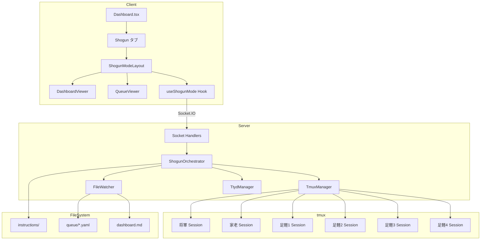

# Design Document: Multi-Agent Shogun Integration

## Overview

multi-agent-shogunをclaude-code-managerにフル統合し、将軍-家老-足軽の階層構造で複数のClaude Codeインスタンスを協調動作させる「将軍モード」を実装する。

既存のTmuxManager、SessionOrchestrator、TtydManagerを再利用・拡張し、新たにShogunOrchestratorとFileWatcherを追加する。

## Steering Document Alignment

### Technical Standards (tech.md)
- TypeScript + ESM
- Express + Socket.IO（バックエンド）
- React 19 + TailwindCSS + shadcn/ui（フロントエンド）
- EventEmitterベースのイベント駆動設計

### Project Structure (structure.md)
```
server/lib/     # バックエンドロジック
client/src/     # フロントエンド
  components/   # UIコンポーネント
  hooks/        # カスタムフック
shared/         # 共有型定義
```

## Code Reuse Analysis

### Existing Components to Leverage

- **TmuxManager**: tmuxセッション作成・キー送信・セッション復元をそのまま再利用
- **TtydManager**: ttydインスタンス起動・ポート管理をそのまま再利用
- **SessionOrchestrator**: イベントフォワーディングパターンを参考に設計
- **MultiPaneLayout**: グリッドレイアウト・最大化機能を拡張
- **useSocket**: Socket.IO接続管理・イベントハンドリングを拡張

### Integration Points

- **既存SessionOrchestrator**: 将軍モードは独立したオーケストレーターとして実装、既存機能と共存
- **Socket.IOイベント**: 既存イベントに加え、`shogun:*`プレフィックスのイベントを追加
- **Database**: 既存のSQLiteスキーマにshogun_modesテーブルを追加

## Architecture



### Modular Design Principles

- **Single File Responsibility**: ShogunOrchestratorは将軍モード管理のみ、FileWatcherはファイル監視のみ
- **Component Isolation**: 将軍モード関連コンポーネントは既存コンポーネントと分離
- **Service Layer Separation**: Orchestrator（ビジネスロジック）とManager（インフラ）を分離
- **Utility Modularity**: instructions読み込み、YAMLパースは独立モジュール化

## Components and Interfaces

### ShogunOrchestrator (server/lib/shogun-orchestrator.ts)

- **Purpose**: 将軍モード全体のライフサイクル管理
- **Interfaces**:
  ```typescript
  class ShogunOrchestrator extends EventEmitter {
    startShogunMode(worktreePath: string, ashigaruCount?: number): Promise<ShogunMode>
    stopShogunMode(modeId: string): Promise<void>
    getShogunMode(modeId: string): ShogunMode | undefined
    getShogunModeByWorktree(worktreePath: string): ShogunMode | undefined
    getAllShogunModes(): ShogunMode[]
    sendToRole(modeId: string, role: Role, message: string): void
  }
  ```
- **Dependencies**: TmuxManager, TtydManager, FileWatcher
- **Reuses**: EventEmitterパターン（SessionOrchestrator参考）

### FileWatcher (server/lib/file-watcher.ts)

- **Purpose**: queue/*.yaml と dashboard.md の変更監視
- **Interfaces**:
  ```typescript
  class FileWatcher extends EventEmitter {
    watch(worktreePath: string, modeId: string): void
    unwatch(modeId: string): void
    getQueueData(modeId: string): QueueData | null
    getDashboardContent(modeId: string): string | null
  }
  // Events: 'queue:updated', 'dashboard:updated'
  ```
- **Dependencies**: chokidar, js-yaml
- **Reuses**: EventEmitterパターン

### ShogunModeLayout (client/src/components/ShogunModeLayout.tsx)

- **Purpose**: 将軍モード専用の階層レイアウト
- **Interfaces**:
  ```typescript
  interface ShogunModeLayoutProps {
    mode: ShogunMode;
    sessions: Map<string, TtydSession>;
    dashboard: string | null;
    queue: QueueData | null;
    onSendMessage: (sessionId: string, message: string) => void;
    onSendKey: (sessionId: string, key: string) => void;
    onStopMode: () => void;
  }
  ```
- **Dependencies**: TerminalPane, DashboardViewer, QueueViewer
- **Reuses**: MultiPaneLayoutのグリッドシステム

### useShogunMode (client/src/hooks/useShogunMode.ts)

- **Purpose**: 将軍モードの状態管理とSocket.IO通信
- **Interfaces**:
  ```typescript
  function useShogunMode(): {
    shogunMode: ShogunMode | null;
    isStarting: boolean;
    dashboard: string | null;
    queue: QueueData | null;
    startShogunMode: (worktreePath: string) => void;
    stopShogunMode: () => void;
    sendToShogun: (message: string) => void;
  }
  ```
- **Dependencies**: useSocket
- **Reuses**: useSocketのイベントハンドリングパターン

## Data Models

### ShogunMode
```typescript
interface ShogunMode {
  id: string;
  worktreePath: string;
  status: 'starting' | 'running' | 'stopping' | 'stopped' | 'error';
  shogunSessionId: string;
  karoSessionId: string;
  ashigaruSessionIds: string[];  // 4 sessions
  createdAt: Date;
  lastActivity: Date;
}
```

### QueueData
```typescript
interface QueueData {
  shogunToKaro: {
    command_id: string;
    content: string;
    status: string;
    timestamp: string;
  } | null;
  karoToAshigaru: Map<number, {
    task_id: string;
    content: string;
    status: string;
    assigned_to: number;
  }>;
}
```

### Role
```typescript
type Role = 'shogun' | 'karo' | 'ashigaru1' | 'ashigaru2' | 'ashigaru3' | 'ashigaru4';
```

## Socket.IO Events

### Client → Server

| Event | Payload | Description |
|-------|---------|-------------|
| `shogun:start` | `{ worktreePath: string }` | 将軍モード起動 |
| `shogun:stop` | `{ modeId: string }` | 将軍モード停止 |
| `shogun:sendToRole` | `{ modeId: string, role: Role, message: string }` | 特定ロールにメッセージ送信 |
| `shogun:sendKey` | `{ modeId: string, role: Role, key: string }` | 特定ロールにキー送信 |

### Server → Client

| Event | Payload | Description |
|-------|---------|-------------|
| `shogun:started` | `ShogunMode` | 将軍モード起動完了 |
| `shogun:stopped` | `{ modeId: string }` | 将軍モード停止完了 |
| `shogun:status` | `{ modeId: string, status: string }` | ステータス更新 |
| `shogun:dashboard` | `{ modeId: string, content: string }` | dashboard.md更新 |
| `shogun:queue` | `{ modeId: string, queue: QueueData }` | キュー更新 |
| `shogun:error` | `{ modeId: string, error: string }` | エラー |

## tmux Session Naming

| Role | Session Name Pattern | Example |
|------|---------------------|---------|
| 将軍 | `ccm-shg-{shortId}` | `ccm-shg-abc123` |
| 家老 | `ccm-kro-{shortId}` | `ccm-kro-abc123` |
| 足軽1 | `ccm-as1-{shortId}` | `ccm-as1-abc123` |
| 足軽2 | `ccm-as2-{shortId}` | `ccm-as2-abc123` |
| 足軽3 | `ccm-as3-{shortId}` | `ccm-as3-abc123` |
| 足軽4 | `ccm-as4-{shortId}` | `ccm-as4-abc123` |

## File Structure (New/Modified)

```
server/lib/
├── shogun-orchestrator.ts    # NEW: 将軍モード管理
├── file-watcher.ts           # NEW: ファイル監視
├── instructions-loader.ts    # NEW: instructions読み込み
└── shogun-socket-handlers.ts # NEW: Socket.IOハンドラー

client/src/
├── components/
│   ├── ShogunModeLayout.tsx  # NEW: 階層レイアウト
│   ├── DashboardViewer.tsx   # NEW: dashboard.md表示
│   ├── QueueViewer.tsx       # NEW: キュー表示
│   └── RolePane.tsx          # NEW: ロール別ペイン
├── hooks/
│   └── useShogunMode.ts      # NEW: 将軍モードフック
└── pages/
    └── Dashboard.tsx         # MODIFIED: Shogunタブ追加

shared/
└── types.ts                  # MODIFIED: 型追加

instructions/                 # NEW: multi-agent-shogunから移植
├── shogun.md
├── karo.md
└── ashigaru.md

templates/                    # NEW: テンプレート
├── dashboard.md
└── queue/
    ├── shogun_to_karo.yaml
    └── karo_to_ashigaru.yaml
```

## Error Handling

### Error Scenarios

1. **セッション起動失敗**
   - **Handling**: 部分的に起動したセッションをクリーンアップ、エラーイベント発行
   - **User Impact**: エラーメッセージ表示、再試行ボタン

2. **tmuxセッション消失**
   - **Handling**: 定期的なヘルスチェックで検出、ステータスを'error'に更新
   - **User Impact**: ペインに警告表示、再起動オプション

3. **ファイル監視エラー**
   - **Handling**: エラーログ出力、監視継続を試みる
   - **User Impact**: ダッシュボード/キュー表示が更新されない旨を通知

4. **WebSocket切断**
   - **Handling**: 既存のuseSocket再接続ロジックを継承
   - **User Impact**: 接続状態インジケーター表示

## Testing Strategy

### Unit Testing
- ShogunOrchestrator: セッション起動/停止ロジック
- FileWatcher: ファイル変更検知
- 各コンポーネントの個別テスト

### Integration Testing
- Socket.IOイベント送受信
- tmuxセッションとttydの連携
- ファイル変更→UI更新フロー

### End-to-End Testing
- 将軍モード起動→指示送信→停止の一連フロー
- 既存機能（通常セッション）との共存確認
- リモートアクセス時の動作確認
